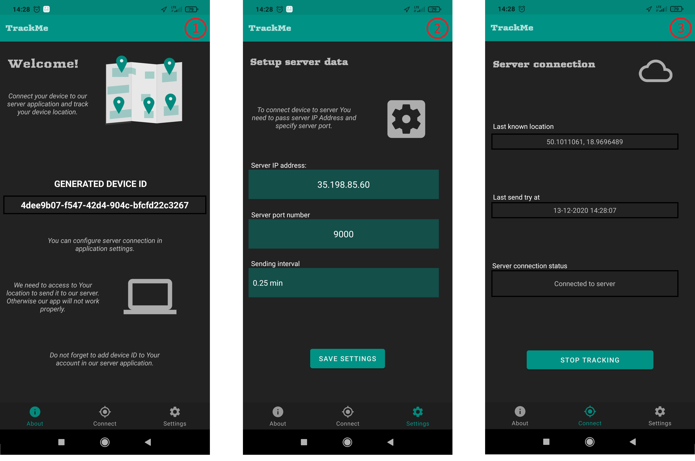

# TrackMe
---

Basic Android app that allows to send You location to specified server and works in background (with notification).

---

App has been created base on Google sample for managing location data in Android 11.

---

Works with TrackIt application. See another repository: https://github.com/latusikl/TrackIt.

Inside repository You can find *.apk* file with current application version.